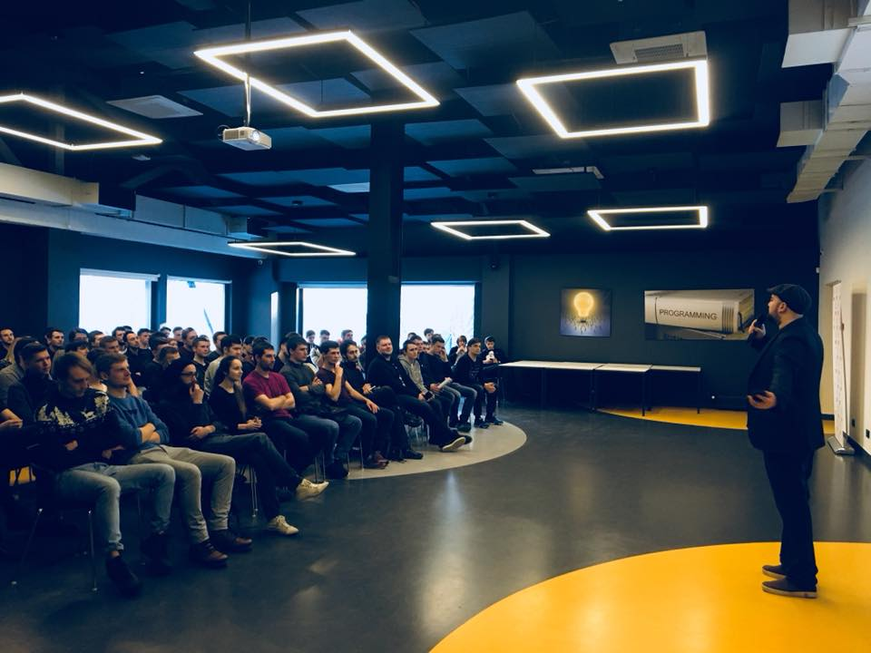
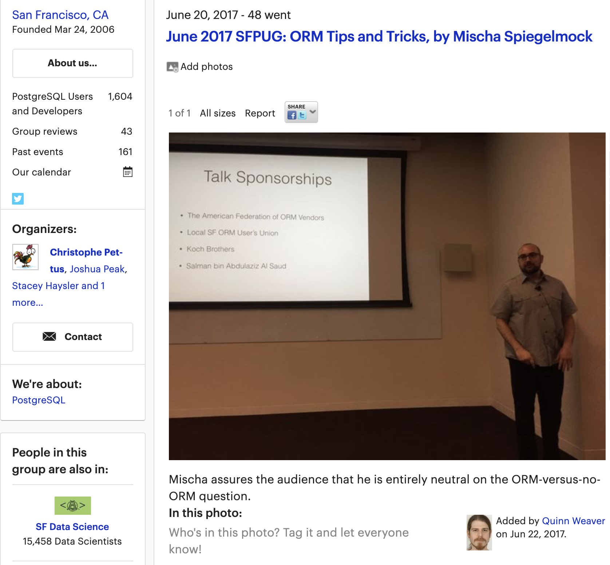
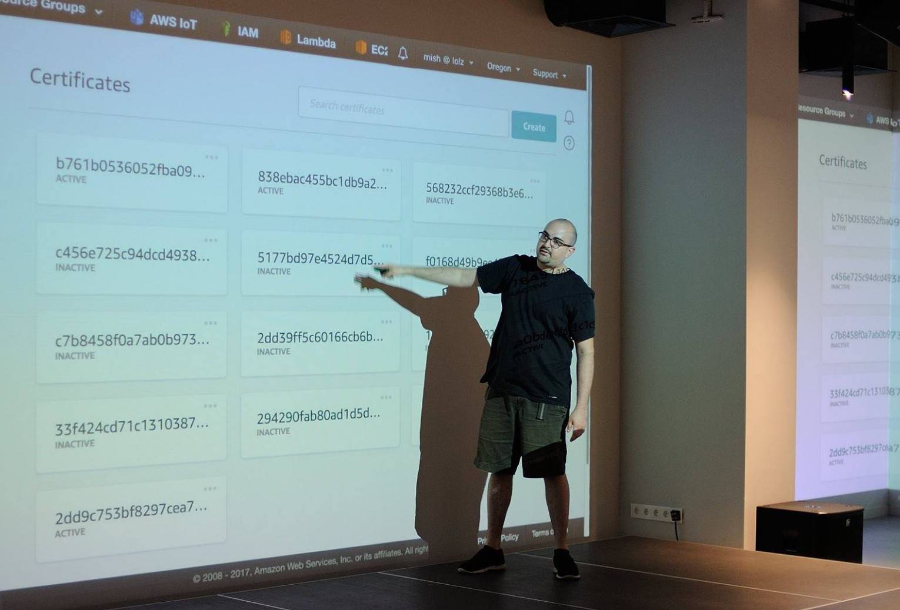

Here you can find a collection of some talks I've prepared and given.

I enjoy educating people about topics I find interesting and giving demos of useful tools and techniques that have made my life easier.

If you'd like me to come talk somewhere, on one of the topics below or anything else, please feel free to [shoot me an email](mailto:me@mish.dev). You can find out more about what I'm interested in and playing with these days at [my blog](https://spiegelmock.com).

## Past Talks

### Serverless Application Architecture - [❑ Slides](slides/serverless.pdf)
-  Presented at International Software Architect Club, Kyiv 2019
-  Presented for Very Good Security engineering, Barcelona 2019

A look at what serverless architecture means for application developers, benefits and limitations of serverless, and why you may or may not want to consider using AWS Lambda.

### Getting Started As A Software Engineer - [❑ Slides](slides/getting-started-as-a-software-engineer.pdf)
- Presented at Kyiv Polytechnic Institute, 2019
- Presented at Unit Factory (Ecole42 School), Kyiv 2018
- Presented at Projector Academy, Kyiv 2018

A talk for software engineering students to inspire and give confidence in the beginning of their careers, look at how computers work, soft skills, cultural expectations, and all the other non-technical aspects of creating software as a professional.

### IoT: Security, Best Practices, Using The Cloud - [❑ Slides](slides/IoT_noVideo.pdf)
-  Presented at [Unit City](http://unit.city) (their first public tech talk), Kyiv 2018

Looking past the internet of things hype. A focus important aspects of internet of things security failures and best practices for building secure devices. How to build cloud-native serverless IoT applications using AWS.

### ORM: Friend Or Foe? - [❑ Slides](slides/ORM.pdf)
-  Presented at the PostgreSQL User's Group, San Francisco 2017

The benefits and drawbacks of object relational mappers from the perspective of a developer, with tips and cool tricks. Very lively discussion with an audience of grumpy DBAs.

### Schema Design - [❑ Slides](slides/schema_design.pdf)
-  [Audio](https://soundcloud.com/adam-wood-969912350/mischa-spiegelmock-schema-design-pgsql)
-  Presented at the PostgreSQL User's Group, San Francisco 2016

Lessons learned about designing database schemas and why timezones are a foul curse on software developers.

### Lazy AWS - [❑ Slides](slides/LazyAWS.pdf)
-  Presented at the Advanced Architecture Meetup, San Francisco 2016

How to radically simplify the deployment and orchestration of immutable infrastructure in the cloud using tools like RPM and bash. Some light jibes at the audience of DevOps professionals.

### PostgreSQL LISTEN/NOTIFY - [❑ Slides](slides/pgnotify.pdf)
-  Presented at the PostgreSQL User's Group, University of California Berkeley 2015

Exploring a little-known but very useful feature in PostgreSQL that allows for subscribing to and sending asynchronous notifications using PostgreSQL as a message passing system. How to integrate with long-poll, WebSockets, and DB triggers. Live demo of a geospatial location mapping application with WebSockets and PostGIS.

## Future Talks

### Free and Open Source Software - [❑ Slides](slides/opensource.pdf)

What is open source software? Why should you care about it?

### ProjectM: Open Source Music Visualization - [❑ Slides](slides/projectM_noVideo.pdf)

A look at the open source music visualizer project - projectM. History, how it works, how I've contributed to it.

